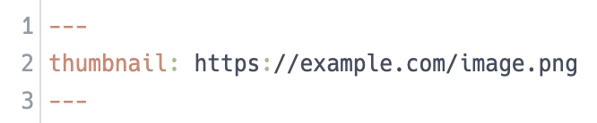

# Inkdrop Thumbnail List Plugin

> Inkdrop plugin to show thumbnail images in note lists

  

This plugin automatically sets the first image as the thumbnail.

You can overwrite it by adding a `thumbnail` key to the front-matter.

The name of the key (default: `thumbnail`) can be changed from settings.

## Changelog

### 0.2.3

- Fixed a bug that non-YAML formatted text in the front matter cause a crash

### 0.2.2

- Changed to get dependencies from npm

### 0.2.1

- Fixed a bug that caused a crash if duplicate keys existed in front-matter

### 0.2.0

- Added some options
- Removed one dependency

### 0.1.0 - First Release