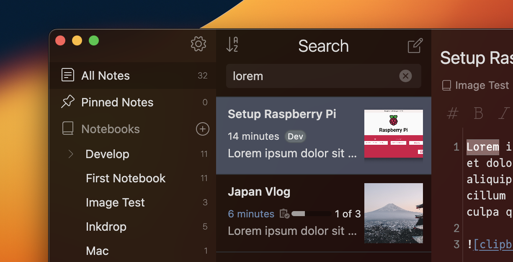

# Inkdrop Thumbnail List Plugin

> Inkdrop plugin to show thumbnail images in note lists

  



This plugin shows thumbnails in your note list.

Basically, it gets the first image of each note, but you can override this by setting a `thumbnail` key in the front-matter.

```yaml
---
thumbnail: https://example.com/imapge.png
---
```

You can also change the name of the key (default: `thumbnail`) from the settings.

## Changelog

### 0.4.0

- Fix a bug that context menu is not displayed in v5.6.0
- Support middle mouse click
- Add missing indications (pin, conflict icons, and absolute datetime for older notes)
- Add `Background Color` option
- Update dependencies

### 0.3.0

- Update dependencies and speed up thumbnail extraction process

### 0.2.6

- Split the URL extraction process into a separate package which uses better regex

### 0.2.5

- Fix a bug that there are extra margins on items without thumbnails

### 0.2.4

- Use `require` instead of `default export` for dayjs

### 0.2.3

- Fix a bug that non-YAML formatted text in the front matter cause a crash

### 0.2.2

- Change to get dependencies from npm

### 0.2.1

- Fix a bug that caused a crash if duplicate keys existed in front-matter

### 0.2.0

- Add some options
- Remove one dependency

### 0.1.0 - First Release